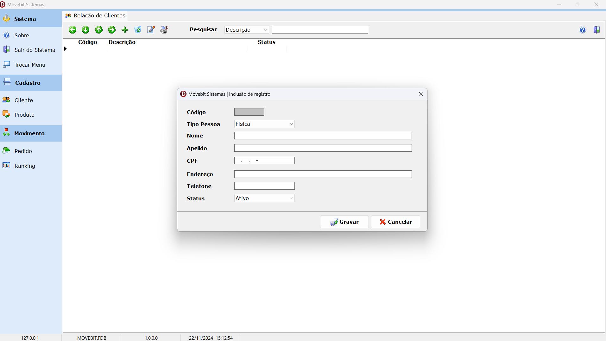

 

## Sobre
O projeto Movebit Delphi foi criado para servir de referência para quem deseja iniciar no desenvolvimento de sistemas utilizando a ferramenta Delphi.

## Preparando o ambiente
Para mexer com o projeto, você precisa ter a ferramenta Delphi instalada em seu equipamento. Para o banco de dados, utilizei o Firebird na versão 2.5 Embedded.

## Atenção
Para fins didáticos, utilizei a versão Community Edition do Delphi 12 (Codinome Athenas). 
Mas você pode reproduzir os mesmos passos em outras versões, pois o princípio será o mesmo.

## Estrutura do projeto
- Bin : Fica o arquivo executável do projeto, as dlls (descompactadas) e o banco de dados (descompactado).
- Src : Fica todo código fonte do projeto
- Tmp : Ficam os arquivos que precisaremos disponibilizar para o projeto funcionar.
  - Data.zip : Contem o arquivo de banco de dados, MOVEBIT.FDB.
  - DLLs.zip : Contem as dlls necessárias para o funcionamento do sistema.
  - Movebit.zip : Contem o projeto pronto.
  
## Instalação do projeto pronto
Dentro do diretório Tmp, encontre o arquivo Movebit.zip. Extraia a pasta para a raiz do seu HD, a unidade C:\. Se você quiser deixá-lo em outro local, não esqueça de alterar o caminho
dentro do arquivo Movebit.ini, pois é a partir dele que o programa busca o banco de dados.

## Segue alguns prints das telas do sistema.

### Tela de login do sistema

### Tela principal (pós login) do sistema

### Tela principal (pós login) do sistema com outra opção de layout para o menu

### Tela de cadastro de clientes

### Tela de cadastro de pedidos

